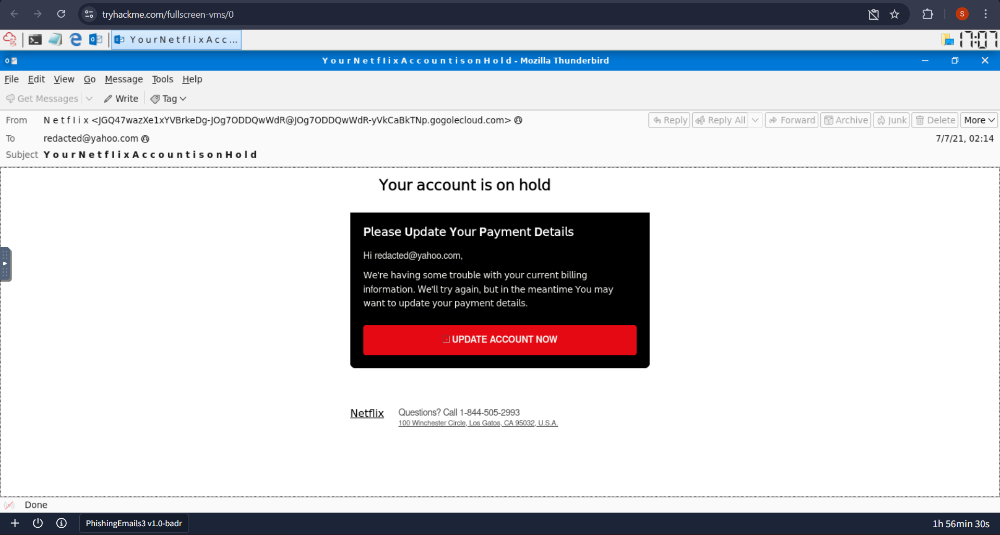
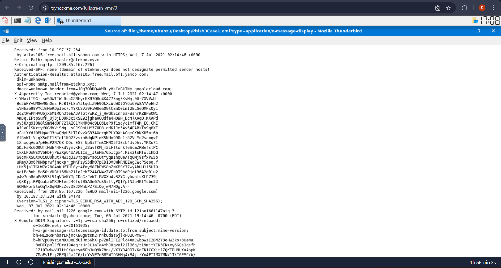
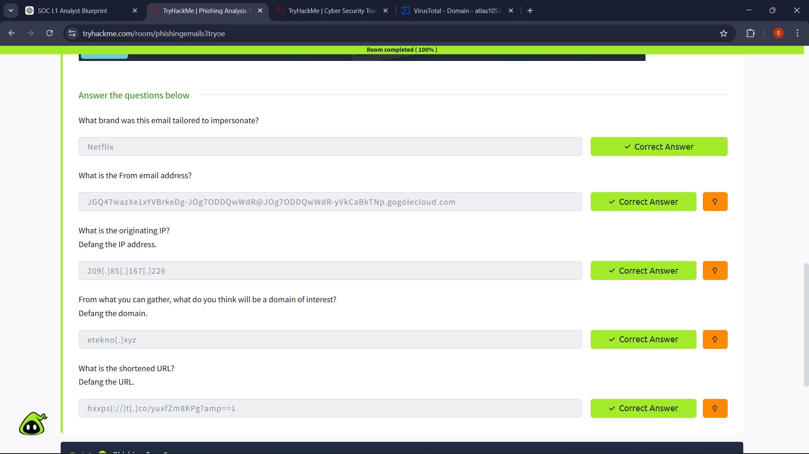

# 📧 SOC Investigation: Phishing Email Analysis

## 📌 Overview
This project demonstrates a SOC Level 1 investigation into a suspected phishing email reported by users. The analysis focuses on email header inspection, IOC extraction, and threat intelligence validation to determine the legitimacy of the email.

---

## 🚨 Scenario
Multiple employees reported receiving a suspicious email claiming to be from **Netflix**. The email prompted users to take urgent action via an embedded link.

As a SOC Level 1 Analyst, the task was to analyze the email, identify indicators of compromise (IOCs), and determine whether the email was malicious.

---

## 🎯 Objective
- Analyze email headers for spoofing indicators  
- Extract and investigate IOCs (IP, domain, URL, sender)  
- Identify phishing characteristics  
- Classify the threat and recommend mitigation steps  

---

## 🔍 Investigation Summary
The email was analyzed using header inspection and threat intelligence techniques. Key findings include:

- The sender domain does not match the impersonated brand (Netflix)  
- SPF validation failed, indicating unauthorized sending source  
- Suspicious domain (`etekno.xyz`) identified in email headers  
- Shortened URL used to obscure the final destination  
- Originating IP linked to suspicious activity  

The combination of these indicators confirms phishing behavior.

---

## 📊 Key Findings
- **Impersonated Brand:** Netflix  
- **Suspicious Email Address:** `JGO47...@googlecloud.com`  
- **Originating IP:** `209.85.167.226`  
- **Suspicious Domain:** `etekno.xyz`  
- **Malicious URL:** `hxxps://t[.]co/yuxfZm8KPg?amp=1`  

---

## 🧠 MITRE ATT&CK Mapping
- **T1566 — Phishing**

---

## 🧠 Analyst Decision
This email has been classified as a **phishing attack** based on:

- Failed email authentication (SPF)  
- Domain spoofing and brand impersonation  
- Use of shortened URL to hide malicious destination  
- Presence of suspicious infrastructure  

**Severity:** Medium–High  
**Reason:** High likelihood of credential harvesting if user interacts with the link  

---

## 🛡️ Recommendations
- Block the domain `etekno.xyz` at the email gateway  
- Block the malicious URL at network/firewall level  
- Flag and quarantine similar emails  
- Educate users on phishing awareness  
- Implement stricter email authentication policies (SPF, DKIM, DMARC)  

---

## 📸 Evidence Screenshots

### Email Header Analysis


*Figure 1: Raw email headers showing authentication results and source IP.*

---

### Header Authentication Results


*Figure 2: SPF failure and suspicious sender domain observed.*

---

### IOC Extraction


*Figure 3: Extracted indicators including domain, IP, and phishing URL.*

---

## 📎 Investigation Files
- Full report: [`report/phishing_case_report.pdf`](report/phishing_case_report.pdf)
- Indicators of Compromise: [`iocs/indicators.md`](iocs/indicators.md)

---

## 📁 Project Structure
```text
phishing-email-investigation/
│
├── README.md
├── report/
│   └── phishing_case_report.pdf
├── screenshots/
│   ├── email_header.png
│   ├── header_analysis.png
│   ├── ioc_extraction.png
├── iocs/
│   └── indicators.md
```
